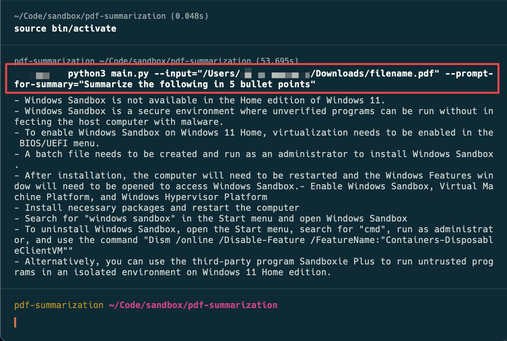

# PDF Summarizer in Python
> A super simple PDF summarization example using OpenAI's gpt-3.5-turbo (you can configure it). It provides a simple and efficient way to extract key information from PDF files and generate concise summaries.

> [!NOTE]  
> This repo is purely for educational purpose

## Tech Stacks Used
- Python 3
- pypdf: A Python library for working with PDF files. It is used to extract text from the PDF documents.
- NLTK (Natural Language Toolkit): A Python library for natural language processing. It is used for text processing and summarization algorithms.
- OpenAI Python SDK

## Features
- Extract text from PDF documents.
- Generate summaries using OpenAI API

## Installation
To install the PDF Summarizer library, follow these steps:

1. Clone the repository: `git clone https://github.com/AshikNesin/pdf-summarizer-openai-python.git`
2. Create a new [virtualenv](https://learnpython.com/blog/how-to-use-virtualenv-python/): `virtualenv -p python3 env`
3. Then use the env: `source env/bin/activate`
2. Install the required dependencies: `pip install -r requirements.txt`

## Usage
To run the virtualenv, run the following command in the root of the repo (if not done already)
```shell
source env/bin/activate
```

To run the summarizer
```shell
python main.py --input /path/to/filename.pdf --prompt-for-summary="Summarize the following in 5 bullet points"
```



## Why build this?
This repository is mainly for educational purposes. My dad is learning to code for fun and attempted to build this project on his own. He ran into issues while trying to build it himself due to outdated resources. So this repo is solely intended as a reference material for him. And I'm also new to Python so might not be the optimal way to do things 🚧


## Acknowledgments
- [The Ultimate Guide to PDF Summarization with OpenAI API: Simplify Your Reading Process](https://medium.com/@kapildevkhatik2/the-ultimate-guide-to-pdf-summarization-with-openai-api-simplify-your-reading-process-80021210cd11) - Blog post is outdated though 😭

## Common Issue: NLTK
I ran into this issue during setup. Just documenting it here for the record

```shell
LookupError:
**********************************************************************
  Resource punkt not found.
  Please use the NLTK Downloader to obtain the resource:

  >>> import nltk
  >>> nltk.download('punkt')

  For more information see: https://www.nltk.org/data.html

  Attempted to load tokenizers/punkt/PY3/english.pickle

  Searched in:
    - '/Users/AshikNesin/nltk_data'
    - '/Users/AshikNesin/pdf-summarization/nltk_data'
    - '/Users/AshikNesin/pdf-summarization/share/nltk_data'
    - '/Users/AshikNesin/pdf-summarization/lib/nltk_data'
    - '/usr/share/nltk_data'
    - '/usr/local/share/nltk_data'
    - '/usr/lib/nltk_data'
    - '/usr/local/lib/nltk_data'
    - ''
**********************************************************************
```

It seems like a dependencies issue. I was able to solve this by running the following command

```shell
python -m nltk.downloader popular
```

## License
MIT
